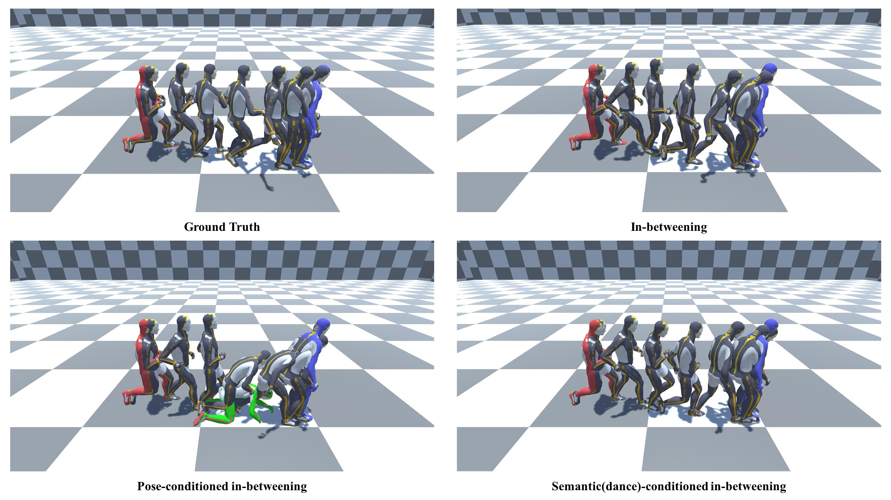

# Conditional Motion In-Betweening (CMIB)

Official implementation of paper: Conditional Motion In-betweeening.

[Paper(Submitted)]() | [Project Page](https://jihoonerd.github.io/Conditional-Motion-In-Betweening/) | [YouTube](https://youtu.be/nEzzzBeek_E )

<p align="center">
  
</p>

## Environments

This repo is tested on following environment:

* Ubuntu 20.04
* Python >= 3.7
* PyTorch == 1.10.1
* Cuda V11.3.109

## Install

1. Follow [`LAFAN1`](https://github.com/ubisoft/ubisoft-laforge-animation-dataset) dataset's installation guide.
   *You need to install git lfs first before cloning the dataset repo.*

2. Run LAFAN1's `evaluate.py` to unzip and validate it. (Install `numpy` first if you don't have it)
   ```bash
   $ pip install numpy
   $ python ubisoft-laforge-animation-dataset/evaluate.py 
   ```
   With this, you will have unpacked LAFAN dataset under `ubisoft-laforge-animation-dataset` folder.

3. Install appropriate `pytorch` version depending on your device(CPU/GPU), then install packages listed in `requirements.txt`. .

## Trained Weights

You can download trained weights from [here](https://drive.google.com/drive/folders/1_cAhuBxbic3rgPdyrR49kvMnA263bYmi?usp=sharing).

## Train from Scratch

Trining script is `trainer.py`.

```bash
python trainer.py \
	--processed_data_dir="processed_data_80/" \
	--window=90 \
	--batch_size=32 \
	--epochs=5000 \
	--device=0 \
	--entity=cmib_exp \
	--exp_name="cmib_80" \
	--save_interval=50 \
	--learning_rate=0.0001 \
	--loss_cond_weight=1.5 \
	--loss_pos_weight=0.05 \
	--loss_rot_weight=2.0 \
	--from_idx=9 \
	--target_idx=88 \
	--interpolation='slerp'

```

## Inference

You can use `run_cmib.py` for inference. Please refer to help page of `run_cmib.py` for more details.

```python
python run_cmib.py --help
```

## Citation

* LAFAN1 Dataset
  ```
  @article{harvey2020robust,
  author    = {Félix G. Harvey and Mike Yurick and Derek Nowrouzezahrai and Christopher Pal},
  title     = {Robust Motion In-Betweening},
  booktitle = {ACM Transactions on Graphics (Proceedings of ACM SIGGRAPH)},
  publisher = {ACM}, 
  volume    = {39},
  number    = {4},
  year      = {2020}
  }
  ```

## Author

* [Jihoon Kim](https://github.com/jihoonerd)
* [Taehyun Byun](https://github.com/childtoy)
